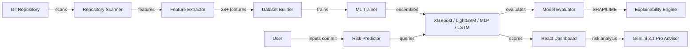
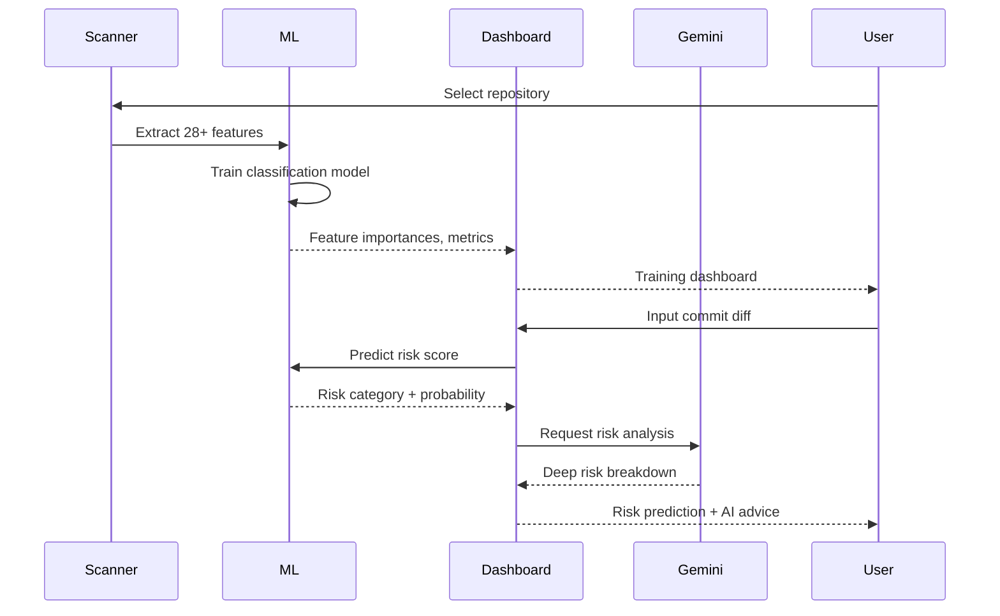

# GitSense AI

ML-powered git commit risk prediction and repository analytics platform. Transforms git history into structured datasets, trains predictive models, and provides real-time commit risk analysis with explainable AI.

## Overview

Ingests git repository history, extracts 28+ software engineering features, trains classification models (XGBoost, LightGBM, MLP, LSTM, GNN), and predicts commit risk before merge. Includes SHAP/LIME explainability, a Gemini AI risk advisor, and an interactive analytics dashboard with timeline charts and file heatmaps.

## Core Architecture



## System Components

| Component | Responsibility |
|---|---|
| `src/lib/` | Feature extraction, ML training, SHAP/LIME explainability |
| `src/components/` | Dashboard, timeline charts, heatmaps, risk panel |
| `server.ts` | Express proxy for Gemini AI risk advisor |
| `src/types.ts` | TypeScript interfaces for features and predictions |

## Repository Layout

| Directory | Purpose |
|---|---|
| `src/lib/` | ML engine, feature extraction, model training |
| `src/components/` | Dashboard and visualization components |
| `server.ts` | Express backend for Gemini AI integration |

## Technology Stack

| Layer | Technology | Purpose |
|---|---|---|
| Language | TypeScript | Type-safe implementation |
| Build | Vite + esbuild | Frontend bundling, server bundling |
| Runtime | Bun / Node.js | Execution environment |
| Backend | Express 4 | Gemini AI proxy server |
| ML | Client-side + XGBoost/LightGBM/CatBoost | Risk classification |
| Deep Learning | MLP, LSTM, Transformer | Sequence and graph models |
| XAI | SHAP, LIME | Feature explainability |
| AI | Gemini 3.1 Pro (high thinking) | Risk advisor |
| UI | React 19 + Tailwind + Recharts | Dashboard and charts |

## Requirements

- Node.js 18+ or Bun
- npm or bun
- Gemini API key (for AI risk advisor)

## Configuration

| File | Purpose |
|---|---|
| `package.json` | Dependencies and scripts |
| `vite.config.ts` | Vite bundler configuration |
| `tsconfig.json` | TypeScript compiler options |
| `server.ts` | Express server for Gemini proxy |
| `.env.example` | Environment variable template |

## Getting Started

```bash
cd gitsense-ai
npm install
cp .env.example .env
# Add GEMINI_API_KEY to .env
npm run dev
```

Open `http://localhost:3000`

## Development

```bash
npm run dev         # Start Vite dev server + Express
npm run build       # Build Vite frontend + bundle server with esbuild
npm run start       # Start production server
```

## Request / Data Flow


